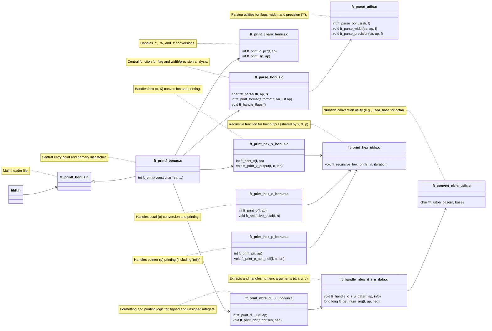

# ft_printf | Gefolgwar

This project has been created as part of the 42 curriculum by psviatus

### Table of Contents

* [1. Description](#1-description)
    * [1.1 Supported Format Specifiers and Flags](#11-supported-format-specifiers-and-flags)
    * [1.2 Mandatory Part: Core `ft_printf`](#12-description---mandatory-part-core-ft_printf)
    * [1.3 Bonus Part: Core Modifiers and Advanced Flags](#13-description---bonus-part-core-modifiers-and-advanced-flags)
* [2. Installation](#2-installation)
* [3. Resources](#3-resources)
    * [3.1 Third-Party Testers](#31-hird-party-testers)
    * [3.2 Useful Links](#32-useful-links)
* [4. Additional section](#4-additional-section)
    * [4.1 Functions](#41-functions)
    * [4.2 Bonus Structure](#42-bonus-structureexclamation)
* [Summary](#summary)

## 1. Description

**ft_printf** ft_printf is a custom implementation of the standard C library function `printf`. 

The project's goals are: 

- learn (`va_list`); 

- learn the logic of format specifier parsing; 

- learn how to build and debug large-scale projects.

### 1. Description - Supported Format Specifiers and Flags

This project is logically divided into two distinct parts: **Mandatory** and **Bonus**, which are compiled **separately!!!**

### 1.2 Description - Mandatory Part: Core `ft_printf`

Format structure: `%[Specifier]`

| Specifier | Type | Purpose |
| :-------: | :--- | :---------: |
| `c` | char | Prints a single character. |
| `s` | string | Prints a string (handles `(null)`). |
| `p` | pointer | Prints the memory address in lowercase hexadecimal (prefix `0x`). |
| `d`, `i` | integer | Prints a signed decimal integer (`int`). |
| `u` | unsigned int | Prints an unsigned decimal integer. |
| `x` | hex (lower) | Prints an unsigned number in lowercase hexadecimal (a-f). |
| `X` | hex (upper) | Prints an unsigned number in uppercase hexadecimal (A-F). |
| `%%` | percent | Prints the percent character `%`. |

### 1.3 Description - Bonus Part: Core Modifiers and Advanced Flags

Format structure: `%[Flags][Width][.Precision][Specifier]`

| Specifier | Type | Purpose |
| :-------: | :--- | :---------: |
| `c` | char | Prints a single character. |
| `s` | string | Prints a string (handles `(null)`). |
| `p` | pointer | Prints the memory address in lowercase hexadecimal (prefix `0x`). |
| `d`, `i` | integer | Prints a signed decimal integer (`int`). |
| `u` | unsigned int | Prints an unsigned decimal integer. |
| `x` | hex (lower) | Prints an unsigned number in lowercase hexadecimal (a-f). |
| `X` | hex (upper) | Prints an unsigned number in uppercase hexadecimal (A-F). |
| `%%` | percent | Prints the percent character `%`. |

| Modifier | Name | Purpose | Example Call | Expected Output |
| :---: | :---: | :--- | :--- | :--- |
| **(Width)** | Minimum Field Width | The minimum number of characters the output should occupy. Default padding is spaces on the left. | `printf("[%10d]", 42)` | `[        42]` |
| **(Precision)** | Precision (Numeric) | For numbers: the minimum number of digits (padded with `0`s). | `printf("[%.5d]", 42)` | `[00042]` |
| **(Precision)** | Precision (String) | For strings (`s`): the maximum number of characters to print. | `printf("[%.3s]", "Hello")` | `[Hel]` |
| **(Combined)** | Width & Precision | Priority is Precision (zeros) first, then Width (spaces) for padding. | `printf("[%10.5d]", 42)` | `[     00042]` |
| **`*`** | Dynamic Argument | Indicates that Width or Precision is specified by the next `va_list` argument. | `printf("[%*d]", 5, 42)` | `[   42]` |
| **`-`** | Left Justification | Pads the text with spaces on the right (overrides `0`). | `printf("[%-10d]", 42)` | `[42        ]` |
| **`0`** | Zero Padding | Pads the output with zeroes instead of spaces (for numeric types; ignored if Precision is set). | `printf("[%010d]", 42)` | `[0000000042]` |
| **`.`** | Zero Precision | Prints nothing if the argument is zero (standard C behavior for `%.0d`). | `printf("[%.0d]", 0)` | `[]` (empty) |

| Bonus Flag | Purpose |
| Flag | Name | Purpose | Example Call | Expected Output |
| :---: | :---: | :--- | :--- | :--- |
| **`#`** | Hex Prefix | Adds `0x` or `0X` prefix to non-zero hexadecimal numbers (`x`, `X`). | `printf("[%#x]", 42)` | `[0x2a]` |
| **` `** | Space Sign | Adds a space before positive numbers (ignored if `+` is present). | `printf("[% d]", 42)` | `[ 42]` |
| **`+`** | Forced Sign | Adds a plus sign (`+`) in front of positive numbers. | `printf("[%+d]", 42)` | `[+42]` |

### Limitations

* **Buffer Management:** `ft_printf` does not implement internal output buffering.
* **Full Feature Set:** Many advanced features of the real `printf` (e.g., floating-point, long long types, locales) are not included.
* **Dependencies:** Performance is limited by the underlying custom `libft` functions used for basic I/O and string manipulation.

## 2. Installation

```shell
make all #Compiles the Mandatory source files and creates the static library libftprintf.a
```
```shell
make bonus #Compiles the Bonus source files, including logic for all advanced flags.
```
```shell
make clean #Removes all object files (.o) from the project and libft.
```
```shell
make fclean #Runs clean and removes the final library file, libftprintf.a.
```
```shell
make re	#Performs a full re-compilation (fclean then all).
```
## 3. Resources

### 3.1 hird-party testers

- [printfTester](https://github.com/Tripouille/printfTester) **pass 100%**
- [gavinfielder/pft](https://github.com/gavinfielder/pft) **pass 100%** Tests completed. 694/694 tests passed.
- [Mazoise/42TESTERS-PRINTF](https://github.com/Mazoise/42TESTERS-PRINTF)
- [HappyTramp/ft_printf_test](https://github.com/HappyTramp/ft_printf_test)
- [t0mm4rx/ftprintfdestructor](https://github.com/t0mm4rx/ftprintfdestructor)
- [charMstr/printf_lover_v2](https://github.com/charMstr/printf_lover_v2)

### 3.2 Useful Links

- [C++ Reference - printf](http://www.cplusplus.com/reference/cstdio/printf/)
- [Article: Secrets of “printf” (PDF)](https://www.cypress.com/file/54441/download)
- [MacOS documentation - printf](https://opensource.apple.com/source/xnu/xnu-201/osfmk/kern/printf.c.auto.html)
- [IEEE-754 Floating Point Converter](https://www.h-schmidt.net/FloatConverter/IEEE754.html)
- [How does one print floats for ft_printf? - Stack Overflow - 42 Network](https://stackoverflow.com/c/42network/questions/133/134#134)
- [Printing Floating-Point Numbers](http://www.ryanjuckett.com/programming/printing-floating-point-numbers/)
- [Printing Floating-Point Numbers Quickly and Accurately with Integers](https://www.cs.tufts.edu/~nr/cs257/archive/florian-loitsch/printf.pdf)
- [What precisely does the %g printf specifier mean? - Stack Overflow](https://stackoverflow.com/questions/54162152/what-precisely-does-the-g-printf-specifier-mean)

## 4. Additional section

### 4.1 Functions

### 4.1.1 ft_printf

`int	ft_printf(const char *str, ...)` - Central entry point and primary dispatcher.

`t_format	ft_newformat(void)` - creates an empty (default) t_format structure.

### 4.1.2 Parsing

`void ft_parse_width(str, ap, f)` - searches for the width value (e.g., 10 in "%10d") or '*' (width is taken from ap).

`static t_format	ft_handle_flags(t_format f)` - Handling flag conflicts. This function implements the rules: '-' overrides '0', '+' overrides ' ', and precision overrides '0' for numbers.

### 4.1.3 Arguments

`static int	ft_print_format(t_format f, va_list ap)` - Calling the dispatcher function, which, based on the specifier, will select and call the required printing function (ft_print_s, ft_print_d_i_u, etc.), passing it the full format description and the list of arguments (ap). Returns the number of characters printed.

### 4.1.4 % + c - Char

`int	ft_print_c_pct(t_format f, va_list ap)` - Handles 'c', '%' conversions.

`static int	ft_print_pct(void)` - helper function to print '%%' and return its result.

### 4.1.5 s - String

`int	ft_print_s(t_format f, va_list ap)` Handles 's' conversions.

`static int	ft_get_str_len(t_format f, char **string)` - This function: 
* a) Handles the case where string == NULL (replacing it with "(null)" or ""). 
* b) Determines s_len by applying the precision limit (f.precision).

### 4.1.5 Numbers

`int	ft_print_d_i_u(t_format f, va_list ap)` - Handles 'd', 'i', and 'u' conversions.

`char	*ft_handle_d_i_u_data(t_format *f, va_list ap, t_num_info *info)` - This function:
* a) Extract the integer argument from va_list (ap) based on specifier ('d', 'i', or 'u'). 
* b) Convert the number to its string representation (nbr), often using malloc. 
* c) Apply precision rules and populate the t_num_info structure. The pointer 'f' is passed by address if the internal function needs to modify format flags (e.g., set '0' to ' ' if precision is active).

`t_num_info` - Structure holding crucial info about the number (sign, length, padding).

`static char	*ft_read_and_convert_num(t_format *f, va_list ap, int *neg)` - Extracts the integer from va_list (ap) according to the specifier ('d', 'i', 'u').
* Converts it into a base string (e.g., using ft_itoa or ft_uitoa).
* Handles negative numbers (by setting info->neg flag).
* Returns a pointer to the string (if memory allocation was successful).

`static int	ft_adjust_precision_and_len(t_format *f, char *nbr, t_num_info *info)` - helper function that:
* Applies the precision rules (f.precision) to the number string (nbr).
* Calculates and sets the final printable length in `info->len`.
* May modify flags in the 'f' structure (e.g., turning off '0' padding if precision is set).

`static long long	ft_get_num_arg(t_format *f, va_list ap, int *neg)` - get correct data type from the `va_list (ap)` based on the format specifier `(f->specifier)` and prepare the necessary flags for printing.

`static int	ft_print_nbr(t_format f, char *nbr, int len, int neg)` - Number printing (DISPATCHER)
* nbr: The starting address of the number string (skips initial sign or prefix if necessary). 
* info.len: The effective length of the number string to print. 
* info.neg: Flag indicating if the number is negative (needed for sign handling).

`static void     ft_calculate_char_to_print(t_format f, t_print_data *data)` - This helper function determines if an extra character (sign, space, or plus) needs to be printed before the number itself, and stores this information in data.char_to_print.

`static int      ft_print_nbr_parts(t_format f, char *nbr, t_print_data data)` - This function is responsible for the precise order of printing: Padding $\to$ Sign $\to$ Precision Zeros $\to$ Number $\to$ Trailing Padding.

### 4.1.6 Octal

`static int ft_recursive_octal(t_format f, unsigned int n)` - Helper function that converts an unsigned integer `n` to its octal representation and prints it recursively.
* Prints octal digits from most significant to least significant.
* Uses the `HEXALOW` mapping (assuming `[0-7]` are correctly mapped).

`static void ft_get_octal_len(unsigned int n, t_format *f, int *len)` - Helper function that determines the effective length of the octal number, adjusting for the precision and the '#' flag.
* Calculates the actual digit length (`*len`) of `n`.
* Applies the precision rule: if `n` is non-zero and '#' is set, the printed length must include the leading '0' (the sharp prefix).
* **Modifies `f->precision`** to be at least the calculated length (or length + 1 if sharp is active).
* Handles the special case where `n=0` and precision is `0` (prints nothing).

`static int ft_print_o_output(t_format f, unsigned int n, int len, int total_len)` - The core printing routine that manages the order of padding, sharp prefix, precision zeros, and the number itself.
* Handles padding with spaces (before the output) when left-justification is disabled (`!f.minus`).
* Handles padding with zeros (before the output) when the '0' flag is set and precision is not active.
* Prints the mandatory leading '0' prefix if the '#' flag is active and it's not already covered by precision.
* Prints the required precision zeros.
* Calls `ft_recursive_octal` to print the octal digits.
* Prints trailing spaces for left-justification (`f.minus`).

`int ft_print_o(t_format f, va_list ap)` - Main dispatcher function for the `%o` specifier.
* Extracts the unsigned integer argument (`n`) from `va_list`.
* Calculates the raw octal length (`len`).
* Calls `ft_get_octal_len` to adjust `len` and format precision.
* Calculates the `total_len` needed for the final output (content width including sharp prefix and precision zeros).
* Calls `ft_print_o_output` to perform the final printing sequence.

### 4.1.7 Hex
`static char *ft_sharp(t_format f)` - Helper function that returns the correct hexadecimal prefix based on the specifier.
* Returns `"0X"` if the specifier is uppercase (`%X`).
* Returns `"0x"` if the specifier is lowercase (`%x`).

`static int ft_print_x_output(t_format f, unsigned int n, int len)` - The core printing routine that manages the order of padding, sharp prefix, precision zeros, and the number itself.
* **Adjusts Width**: Decreases `f.width` by 2 if the '#' flag is set and the number is non-zero, to account for the "0x" prefix.
* **Prints Sharp Prefix (Zero Padding)**: Prints "0x" or "0X" immediately after space padding if the '0' flag is active.
* **Prints Space Padding**: Handles padding with spaces (before the output) when left-justification is disabled (`!f.minus`).
* **Prints Zero Padding**: Handles padding with zeros (before the output) when the '0' flag is set, but only if precision is not specified or is negative.
* **Prints Sharp Prefix (Space Padding)**: Prints "0x" or "0X" immediately after space padding when '0' padding is not used.
* **Prints Precision Zeros**: Prints the required leading zeros dictated by precision (`f.precision - len`).
* **Prints Digits**: Calls `ft_recursive_hex_print` to output the hexadecimal digits.
* **Prints Trailing Padding**: Prints trailing spaces for left-justification (`f.minus`).

`int ft_print_x(t_format f, va_list ap)` - Main dispatcher function for the `%x` and `%X` specifiers. 
* Extracts the unsigned integer argument (`n`) from `va_list`.
* Calculates the raw hexadecimal length (`len`) using base 16.
* **Handles Zero Case 1**: Sets `len = 0` if `n` is 0 and precision is 0 (prints nothing).
* **Adjusts Precision**: If precision is not set, negative, or less than the raw length, sets `f.precision = len`.
* **Handles Zero Case 2**: If `n` is 0 and precision is not set, ensures `len` and `f.precision` are at least 1 (to print a single '0').
* Calls `ft_print_x_output` to perform the final formatted printing sequence.

### 4.1.8 Pointer

`static int ft_ptr_len(size_t n)` - Helper function that calculates the length (number of hexadecimal digits) of a non-zero memory address.
* Iteratively divides the address `n` by 16 to count the digits.
* Returns `0` if the address `n` is `0`.

`static int ft_print_p_null(t_format f)` - Handles the special case where the pointer is `NULL` (i.e., address `0`).
* Prints the string `"(nil)"` (standard behavior in many `printf` implementations).
* Calculates and prints the necessary space padding before or after `"(nil)"` based on `f.width` and `f.minus`.

`static int ft_print_p_non_null(t_format f, size_t n, int len)` - Handles the formatting and printing of a non-null memory address.
* Calculates `total_len` as `2 + len` (for "0x" prefix + hexadecimal digits).
* Calculates `spaces_to_print` based on `f.width`.
* **Prints Padding**: Prints space padding before the address if not left-justified (`!f.minus`).
* **Prints Prefix**: Prints the mandatory prefix `"0x"`.
* **Prints Digits**: Calls `ft_recursive_hex_print` to print the hexadecimal digits (using lowercase).
* **Prints Trailing Padding**: Prints space padding after the address if left-justified (`f.minus`).

`int ft_print_p(t_format f, va_list ap)` - Main dispatcher function for the `%p` specifier. 
* Extracts the pointer address (`n`) from `va_list` as a `size_t` (unsigned integer type large enough to hold the address).
* **Handles NULL**: If `n` is `0`, calls `ft_print_p_null` immediately.
* **Calculates Length**: For non-null pointers, calculates the hexadecimal digit length using `ft_ptr_len`.
* **Sets Precision**: Sets `f.precision` equal to the calculated length (precision is generally ignored for `%p` but this ensures the full length is printed).
* Calls `ft_print_p_non_null` to perform the formatted printing sequence.

### 4.2 Bonus Structure:exclamation

`ft_printf()`s bonus code base has the following file structure:



## Summary

December 20th, 2025