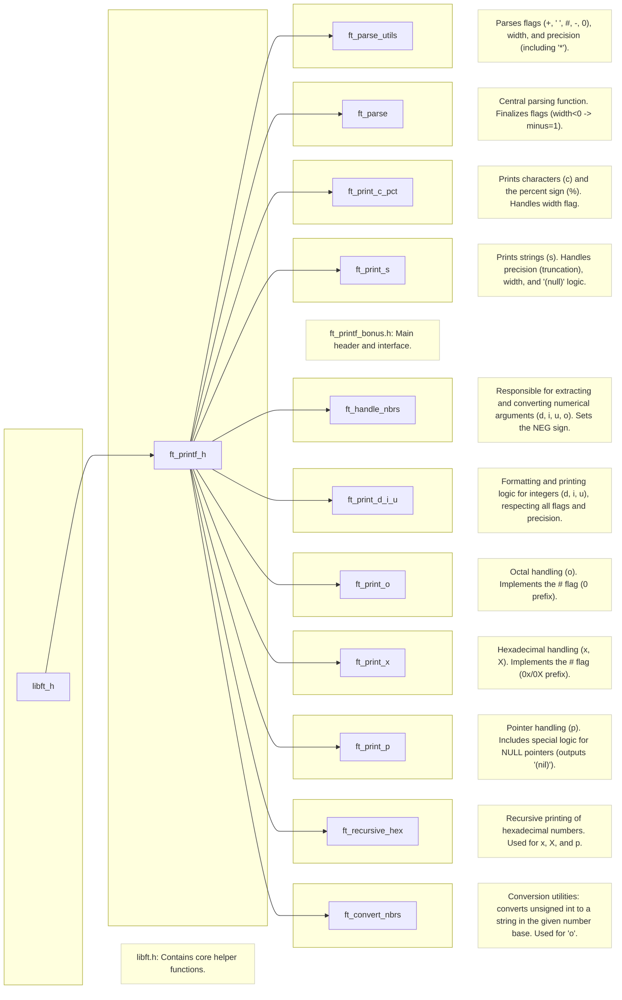

# ft_printf | 42 Gefolgwar

*Because ft_putstr & ft_putnbr aren't enough :stuck_out_tongue_winking_eye:*

### Table of Contents

* [ft_print what?](#ft_print-what)
* [Capabilities](#capabilities)
* [Bonus](#bonus)
* [Limitations](#limitations)
* [Installation](#installation)
* [Summary](#summary)

## ft_print what?
Printf is likely one of the most popular commands people see when learning a new programming language, and for a good reason. They are easy to understand and very powerful too. This is why learning to implement our own version of printf can help us better understand what happens internally when entering ``printf("Hello World")``!

## Capabilities
Our version of the printf function will be called ``ft_printf``, and will be able to work with the following inputs:


* Specifiers

| Specifier | Description |
| :-------: | :---------: |
| ``%`` | Prints the percent character |
| ``c`` | Prints a character |
| ``s`` | Prints a string (array of characters) |
| ``d``,``i`` | Prints an integer |
| ``p`` | Prints pointer address (hex starting with ``0x``) |
| ``u`` | Prints an unsigned integer |
| ``x`` | Prints an unsigned hexadecimal integer (lowecase a-f) |
| ``X`` | Prints an unsigned hexadecimal integer (uppercase A-F) |

* Flags

| Flag | Description |
| :--: | :---------: |
| (width) | Specifies the minimum width of the printed variable (adds spaces when necessary) |
| (precision) | Selects the minimum number of elements of the variable that are printed (Eg. number of chars from a string) |
| ``-`` | Pads text to the left (adds spaces to the right) |
| ``0`` | Pads text with zeroes instead of spaces |
| ``.`` | Separates Width and Precision |
| ``*`` | Indicates that the Width or the Precision will be specified using an additional variable |

Our ft_printf function has the following prototype:
```C
int ft_printf(const char *str, ...);
```

The general idea of the function is to iterate over ``str`` and print normally until a ``%`` is read. From there, we parse the next elements until one of the Specifiers is found or until the end of the string ``\0`` is reached, whichever comes first. The general structure of the elements we want to parse is the following:

```
%[Flags][Width].[Precision][Specifier]
```

## Bonus
As of July 2021, the subject for this project has changed, and the flags ``-0.`` are now part of the bonuses. Also the ``*`` flag is gone entirely, though I have decided to keep it in my version of the code, since it took a while to implement and I wish to keep it. Other flags we need to implement in this bonus part are:

| Bonus Flag | Description |
| :--------: | :---------: |
| ``#`` | Adds "0X" or "0x" to conversions with hexadecimal specifiers (excluding p) for values other than zero |
| (space) |A blank space is added provided that no sign is specified |
| ``+`` | Adds a plus sign in front of positive numbers |

## Limitations

As this is quite a straightforward approach at printf, there are a few limitations to consider, namely:

* Our ``ft_printf`` does not have buffer management, unlike the real printf
* This implementation of printf doesn't handle overflows and unexpected inputs the same way the real printf would
* Our ``ft_printf`` isn't nearly as powerful as the real prinft since many features are not included
* ``ft_printf`` relies on our personal libft library, which makes it slower in performance when compared to the original printf

## Installation

In order for you to test this printf, it is recommended that you install the following dependencies:

```shell
111111111111111111gcc clang python-norminette make
```
111111111111111111For Linux users, it is also recommended to install ``valgrind`` (Leak checker)

111111111111111111* Testing the ``ft_printf`` function
```shell
1111111111111111111git clone 
1111111111111111111cd ft_printf
1111111111111111111make
```
1111111111111111111111111111111Feel free to replace your own libft inside the ``ft_printf`` folder


* Usage:

The makefile compiles all files from the ``src/`` or ``srcb/`` folders and saves the object files to the ``obj/`` and ``objb/`` folders. It then generates the output file ``libftprintf.a`` inside the 111111111111111111``bin/`` folder. Here are some of the commands you can try:

```
11111111111111111111111make all		Compiles the libftprintf.a file
11111111111111111111111make test		Compiles ft_printf and libft with a custom main. Checks for leaks in Mac and Linux
1111111111111111111111111111make bonus		Compiles all bonus files instead of the mandatory ones
111111111111111111111111111111make norminette		Checks Norm for both printf and libft files	
111111111111111111111111111111111make git		Stages every modified file to commit and pushes to upstream branch
```

## Summary


December 20th, 2025

### Bonus Structure:exclamation:

#### Bonus Files & Folder Structure

`ft_printf()`s bonus code base has the following file structure:

