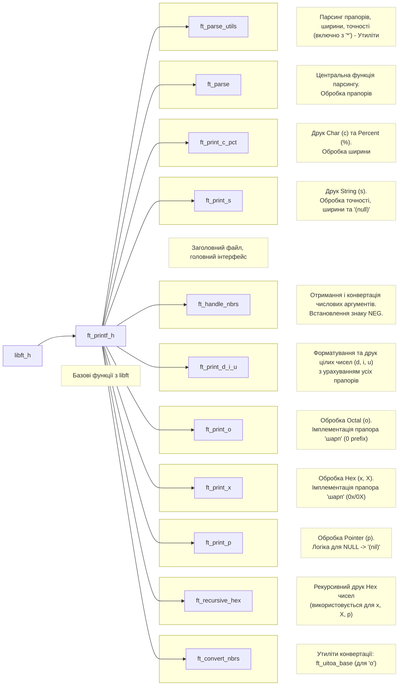

```mermaid
flowchart LR
 subgraph subP[" "]
        P["ft_parse"]
  end
 subgraph subPU[" "]
        PU["ft_parse_utils"]
  end
 subgraph subHN[" "]
        HN["ft_handle_nbrs"]
  end
 subgraph subDIU[" "]
        DIU["ft_print_d_i_u"]
  end
 subgraph subX[" "]
        X["ft_print_x"]
  end
 subgraph subO[" "]
        O["ft_print_o"]
  end
 subgraph subPP[" "]
        PP["ft_print_p"]
  end
 subgraph subRH[" "]
        RH["ft_recursive_hex"]
  end
 subgraph subCP[" "]
        CP["ft_print_c_pct"]
  end
 subgraph subS[" "]
        S["ft_print_s"]
  end
 subgraph subCN[" "]
        CN["ft_convert_nbrs"]
  end
    LH["libft_h"] --> H["ft_printf_h"]
    H --> PU & P & CP & S & HN & DIU & O & X & PP & RH & CN
    H ~~~ noteH["Заголовний файл, головний інтерфейс"]
    LH ~~~ noteLH["Базові функції з libft"]
    P ~~~ noteP["Центральна функція парсингу.<br>Обробка прапорів"]
    PU ~~~ notePU@{ label: "Парсинг прапорів, ширини, точності (включно з '*') - Утиліти" }
    HN ~~~ noteHN["Отримання і конвертація числових аргументів.<br>Встановлення знаку NEG."]
    DIU ~~~ noteDIU["Форматування та друк цілих чисел (d, i, u)<br>з урахуванням усіх прапорів"]
    X ~~~ noteX@{ label: "Обробка Hex (x, X).<br>Імплементація прапора 'шарп' (0x/0X)" }
    O ~~~ noteO@{ label: "Обробка Octal (o).<br>Імплементація прапора 'шарп' (0 prefix)" }
    PP ~~~ notePP@{ label: "Обробка Pointer (p).<br>Логіка для NULL -&gt; '(nil)'" }
    RH ~~~ noteRH["Рекурсивний друк Hex чисел<br>(використовується для x, X, p)"]
    CP ~~~ noteCP["Друк Char (c) та Percent (%).<br>Обробка ширини"]
    S ~~~ noteS@{ label: "Друк String (s).<br>Обробка точності, ширини та '(null)'" }
    CN ~~~ noteCN@{ label: "Утиліти конвертації: ft_uitoa_base (для 'o')" }

    notePU@{ shape: rect}
    noteX@{ shape: rect}
    noteO@{ shape: rect}
    notePP@{ shape: rect}
    noteS@{ shape: rect}
    noteCN@{ shape: rect}
     noteH:::note
     noteLH:::note
     noteP:::note
     notePU:::note
     noteHN:::note
     noteDIU:::note
     noteX:::note
     noteO:::note
     notePP:::note
     noteRH:::note
     noteCP:::note
     noteS:::note
     noteCN:::note
    classDef sub opacity:0
    classDef note fill:#ffd,stroke:#ccb
```