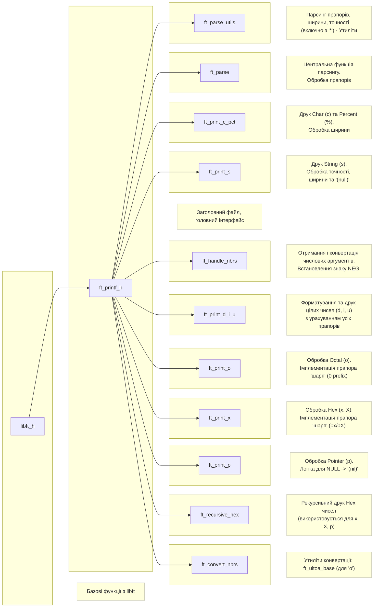

```mermaid
flowchart LR
  subgraph subH[" "]
    H["ft_printf_h"]
  end
  subgraph subLH[" "]
    LH["libft_h"]
  end
  subgraph subP[" "]
    P["ft_parse"]
  end
  subgraph subPU[" "]
    PU["ft_parse_utils"]
  end
  subgraph subHN[" "]
    HN["ft_handle_nbrs"]
  end
  subgraph subDIU[" "]
    DIU["ft_print_d_i_u"]
  end
  subgraph subX[" "]
    X["ft_print_x"]
  end
  subgraph subO[" "]
    O["ft_print_o"]
  end
  subgraph subPP[" "]
    PP["ft_print_p"]
  end
  subgraph subRH[" "]
    RH["ft_recursive_hex"]
  end
  subgraph subCP[" "]
    CP["ft_print_c_pct"]
  end
  subgraph subS[" "]
    S["ft_print_s"]
  end
  subgraph subCN[" "]
    CN["ft_convert_nbrs"]
  end

  LH --> H
  H --> PU & P & CP & S & HN & DIU & O & X & PP & RH & CN

  H ~~~ noteH
  LH ~~~ noteLH
  P ~~~ noteP
  PU ~~~ notePU
  HN ~~~ noteHN
  DIU ~~~ noteDIU
  X ~~~ noteX
  O ~~~ noteO
  PP ~~~ notePP
  RH ~~~ noteRH
  CP ~~~ noteCP
  S ~~~ noteS
  CN ~~~ noteCN

  noteH["Заголовний файл, головний інтерфейс"]:::note
  noteLH["Базові функції з libft"]:::note
  noteP["Центральна функція парсингу.<br>Обробка прапорів"]:::note
  notePU["Парсинг прапорів, ширини, точності (включно з '*') - Утиліти"]:::note
  noteHN["Отримання і конвертація числових аргументів.<br>Встановлення знаку NEG."]:::note
  noteDIU["Форматування та друк цілих чисел (d, i, u)<br>з урахуванням усіх прапорів"]:::note
  noteX["Обробка Hex (x, X).<br>Імплементація прапора 'шарп' (0x/0X)"]:::note
  noteO["Обробка Octal (o).<br>Імплементація прапора 'шарп' (0 prefix)"]:::note
  notePP["Обробка Pointer (p).<br>Логіка для NULL -&gt; '(nil)'"]:::note
  noteRH["Рекурсивний друк Hex чисел<br>(використовується для x, X, p)"]:::note
  noteCP["Друк Char (c) та Percent (%).<br>Обробка ширини"]:::note
  noteS["Друк String (s).<br>Обробка точності, ширини та '(null)'"]:::note
  noteCN["Утиліти конвертації: ft_uitoa_base (для 'o')"]:::note

  classDef sub opacity:0
  classDef note fill:#ffd,stroke:#ccb
```