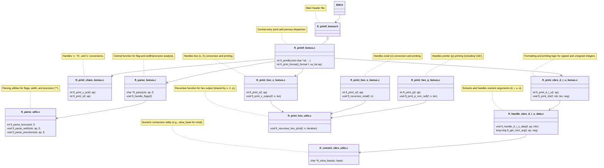

```mermaid
classDiagram
    class libft_h["libft.h"]
    
    class ft_printf_h["ft_printf_bonus.h"]
    class ft_printf_c["ft_printf_bonus.c"]
    class ft_parse_utils["ft_parse_utils.c"]
    class ft_parse["ft_parse_bonus.c"]
    class ft_print_chars["ft_print_chars_bonus.c"]
    class ft_handle_nbrs["ft_handle_nbrs_d_i_u_data.c"]
    class ft_print_nbrs["ft_print_nbrs_d_i_u_bonus.c"]
    class ft_print_hex_o["ft_print_hex_o_bonus.c"]
    class ft_print_hex_x["ft_print_hex_x_bonus.c"]
    class ft_print_hex_p["ft_print_hex_p_bonus.c"]
    class ft_recursive_hex["ft_print_hex_utils.c"]
    class ft_convert_nbrs["ft_convert_nbrs_utils.c"]

    %% Relationships (Flowchart logic translated to Class Diagram inheritance/dependency)
    libft_h --> ft_printf_h
    ft_printf_h <|-- ft_printf_c 
    ft_printf_c --> ft_parse
    ft_printf_c --> ft_print_chars
    ft_printf_c --> ft_print_nbrs
    ft_printf_c --> ft_print_hex_x
    
    ft_parse --> ft_parse_utils
    ft_handle_nbrs --> ft_convert_nbrs 
    ft_print_nbrs --> ft_handle_nbrs
    ft_print_hex_x --> ft_recursive_hex
    ft_print_hex_o --> ft_recursive_hex
    ft_print_hex_p --> ft_recursive_hex
    
    %% Methods (Функції всередині файлів)
    class ft_printf_c["ft_printf_bonus.c"] {
        int ft_printf(const char *str, ...)
        int ft_print_format(t_format f, va_list ap)
    }
    class ft_parse["ft_parse_bonus.c"] {
        char *ft_parse(str, ap, f)
        void ft_handle_flags(f)
    }
    class ft_parse_utils["ft_parse_utils.c"] {
        int ft_parse_bonus(str, f)
        void ft_parse_width(str, ap, f)
        void ft_parse_precision(str, ap, f)
    }
    class ft_handle_nbrs["ft_handle_nbrs_d_i_u_data.c"] {
        void ft_handle_d_i_u_data(f, ap, info)
        long long ft_get_num_arg(f, ap, neg)
    }
    class ft_print_nbrs["ft_print_nbrs_d_i_u_bonus.c"] {
        int ft_print_d_i_u(f, ap)
        void ft_print_nbr(f, nbr, len, neg)
    }
    class ft_print_hex_x["ft_print_hex_x_bonus.c"] {
        int ft_print_x(f, ap)
        void ft_print_x_output(f, n, len)
    }
    class ft_print_hex_o["ft_print_hex_o_bonus.c"] {
        int ft_print_o(f, ap)
        void ft_recursive_octal(f, n)
    }
    class ft_print_hex_p["ft_print_hex_p_bonus.c"] {
        int ft_print_p(f, ap)
        void ft_print_p_non_null(f, n, len)
    }
    class ft_recursive_hex["ft_print_hex_utils.c"] {
        void ft_recursive_hex_print(f, n, iteration)
    }
    class ft_print_chars["ft_print_chars_bonus.c"] {
        int ft_print_c_pct(f, ap)
        int ft_print_s(f, ap)
    }
    class ft_convert_nbrs["ft_convert_nbrs_utils.c"] {
        char *ft_uitoa_base(n, base)
    }

    %% Notes (Використовуємо англійські нотатки для запобігання помилкам парсингу)
    note for ft_printf_h "Main header file."
    note for ft_printf_c "Central entry point and primary dispatcher."
    note for ft_parse "Central function for flag and width/precision analysis."
    note for ft_parse_utils "Parsing utilities for flags, width, and precision ('*')."
    note for ft_handle_nbrs "Extracts and handles numeric arguments (d, i, u, o)."
    note for ft_print_nbrs "Formatting and printing logic for signed and unsigned integers."
    note for ft_print_hex_x "Handles hex (x, X) conversion and printing."
    note for ft_print_hex_o "Handles octal (o) conversion and printing."
    note for ft_print_hex_p "Handles pointer (p) printing (including '(nil)')."
    note for ft_print_chars "Handles 'c', '%', and 's' conversions."
    note for ft_recursive_hex "Recursive function for hex output (shared by x, X, p)."
    note for ft_convert_nbrs "Numeric conversion utility (e.g., uitoa_base for octal)."
```